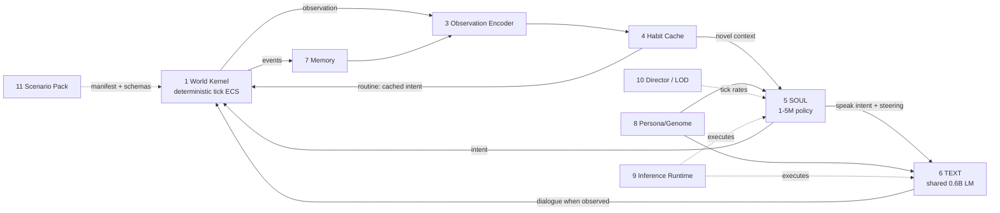

# mini-world — Architecture Design v1

> Sandbox semi-AFK simulation platform where every character is driven by small on-device AI models.
> Design date: 2026-07-12. Research-grounded; sources linked inline. Claims marked `[INFERENCE]` are engineering estimates pending our own benchmarks.

## Concept

Each character has:
- a **SOUL model** — a tiny policy network (~1–5M params) that decides *what to do* every simulation tick: move, attack, interact, speak. It has a "digital body": a tool-calling interface over the scenario's action manifest.
- a shared **TEXT model** — a small LLM (~0.6B) that renders dialogue *only when someone is watching*.

The platform ("base OS") hosts scenario packs on one kernel: village social sims, advanced NPCs, AFK autobattlers/MOBA management, football-manager-style stat games.

Targets consumer laptops and phones (GPU or CPU). No cloud dependency for core play.

## Load-bearing decisions

### 1. Models never mutate the world — they emit intents

The world kernel validates and executes every intent. Consequences:

- **Determinism & replay.** Cross-device bitwise NN equality is unachievable (thread scheduling, backend kernels, quantization differences). Therefore the **validated-intent log is the ground truth**: record sim seed + model hash + backend ID + chosen intents and analytic fast-forward segments. Replay and multiplayer verification replay intents; AFK fast-forward consumes each `FfSegment` analytically. NN output is always advisory.
- **Canonical application order.** `World::apply_intents` sorts each tick's batch by entity id (`index`, then `generation`) before validation, execution, and logging. Per-entity RNG draws are keyed by `(seed, entity, stream, tick)`, so a character's draws do not depend on iteration order; conflicting effects are resolved by the canonical entity-id apply order rather than by submission order.
- **Swappable brains.** Utility-AI stub today, distilled net tomorrow, cloud LLM for hero characters — same socket.
- **Scenario rules are uncheatable.** The kernel rejects invalid calls (range, cooldowns, resources) regardless of what the brain proposes.

### 2. Shared weights + per-character state, never per-character weights

1,000 characters × unique 10M-param models = gigabytes of cold-cache weights — dead on a phone. Instead: one hot SOUL network shared by all characters, each conditioned on its own persona/memory/experience state. Character identity lives in **data** (~10–100KB each), not weights. A thousand divergent individuals ≈ one MP3.

### 3. SOUL is a tool-caller, the body is the toolset

Each scenario pack registers an **action manifest** — typed action schemas, MCP-tool-shaped:

```
move(direction | target)        attack(target, style?)
interact(target, verb)          speak(target, act, topic)
craft(recipe)                   trade(target, offer)
follow(target)                  flee(threat)                idle()
```

- Every SOUL tick sees the observation **plus which tools the body currently affords** (masked action space: no `attack` if disarmed, no `craft` away from a bench).
- SOUL output = discrete head (pick tool) + pointer head (pick target among observed entities) + param head (scalars).
- The kernel is the tool executor: validate → apply → emit result events into the character's memory. Call → result → context, at simulation speed.
- 10–30 tools per scenario is a *classification* problem, not a language problem — that's why SOUL stays tiny.
- The manifest is the scenario-pack API surface: football pack registers `pass/shoot/press/train`; MOBA pack registers `farm/gank/push/recall`. Same SOUL architecture, different manifest + retrained head.

### 4. TEXT is attention-gated ("latent dialogue")

SOUL emits `speak(target, act, topic)`; the mechanical outcome (relationship delta) always applies, but words are rendered **only when observed** — player nearby, log open, replay inspection. Off-screen conversations stay latent, generated on demand.

Measured phone decode makes this mandatory, not optional: a 0.6B-class model yields single-digit concurrent dialogues per device. Dialogue cost must scale with *attention*, not population.

**Research status: no shipped prior art found** for render-only-when-observed NPC dialogue (closest: AGA's ~100-token social summaries). This is a novel design bet — v0 must prove it early.

### 5. Say/do coherence: TEXT renders decisions, never makes them

Project Sid's PIANO identified say/do divergence as the core coherence failure (chat says pickaxe, body does otherwise). Enforcement: TEXT is constrained to verbalize the act SOUL already committed. One decision-maker per character.

## Building blocks



### 1. World Kernel
Deterministic, fixed-timestep, tick-based, ECS-style. Seeded RNG, no wall-clock. Owns all truth: entities, positions, stats, relationships, inventory. Validates and executes intents. The canonical hash also folds pack-owned state through `ScenarioPack::hash_state`; this is what makes AFK progression (= fast-forwarding the sim) and replay (= debugging + training-data generation) verifiable.

### 2. Action Manifest (the digital body)
Per-scenario typed tool schemas with affordance masking. See load-bearing decision 3.

### 3. Observation Encoder
The ratified rich observation schema is `mw_agents::obs::AgentObs`: fixed-size self needs, eight nearest enriched neighbors, event buckets, goal, and afforded-tool mask. The kernel's `mw_core::Observation` is the minimal seam — tick, position, nearest slots, event count, and tool mask — used for one kernel scan and affordance masking. `World::observe_for_policy` constructs that minimal observation once, then passes it to `ScenarioPack::afforded_tools`; the pack fills the mask without a second neighbor scan. The SOUL-facing `AgentObs` can therefore evolve without changing the kernel seam.

### 4. Habit Cache *(added from research)*
Sits between observation and SOUL. Caches decisions as **plan→actions + explicit validity predicates**; replays while predicates hold, invokes SOUL only on novel/invalidated contexts. Evidence: Affordable Generative Agents cut token cost to 31–43% of baseline with *higher* human-rated quality using exactly this pattern (cosine plan-match 0.97 + state conditions) — [arXiv:2402.02053](https://arxiv.org/abs/2402.02053).

Dual role: it is also the **habit tier of character plasticity** — each cache is unique, grown from that character's history. Characters get cheaper as they settle into routines, like the real world.

### 5. SOUL model
Tiny discrete policy, ~1–5M params, **not an LLM**. Input: encoded observation + persona vector + experience embedding. Output: tool + target + params (see decision 3). Runs every N ticks per character (LOD-dependent), batched.

Feasibility evidence:
- Decision Transformer: structured state→action at ~1.1M params (~1–2MB int8) — [repo](https://github.com/kzl/decision-transformer)
- TD-MPC2: 1M/5M checkpoints across 104 control tasks — [repo](https://github.com/nicklashansen/tdmpc2)
- Throughput `[INFERENCE]`: 1–10M INT8 policy, batched — ~1k–10k agents/s laptop, ~200–2k/s phone; memory-bandwidth-bound; benchmark required.

Training roadmap:
- **v0**: hand-written utility-AI scorer behind the same interface (zero ML; ships the game loop).
- **v1**: distill an LLM playing characters. Recipe validated by NeurIPS 2025 agent distillation ([arXiv:2505.17612](https://arxiv.org/abs/2505.17612)): ~2,000 filtered teacher trajectories + LoRA + self-consistent action sampling let a 0.5B student beat a 3× larger CoT baseline. Add SOD-style divergence weighting to avoid error cascades ([arXiv:2605.07725](https://arxiv.org/abs/2605.07725)). Intermediate abstract-action tokens per OpenHA ([arXiv:2509.13347](https://arxiv.org/abs/2509.13347)).

### 6. TEXT model
One shared instruct model, Q4, never in the tick loop, priority-queued (player-facing > ambient > AFK digests).

- **Pick: Qwen3-0.6B, Q4_0 = 364MB file** ([HF](https://huggingface.co/unsloth/Qwen3-0.6B-GGUF)); alternatives: Gemma3-270M Q4 ≈ 230MB, Gemma3-1B / Llama-3.2-1B Q4 ≈ 690–770MB. Runtime RSS > file size (KV cache etc.).
- Measured phone decode: TinyLlama 1.1B Q4_0 on llama.cpp/Metal: A14 39 → A17 Pro 57 → A19 87 tok/s ([official bench, 2023 baseline](https://github.com/ggml-org/llama.cpp/discussions/4508)); Qwen2.5-0.5B int8 ~30 tok/s on S24 Ultra CPU ([LiteRT card](https://huggingface.co/litert-community/Qwen2.5-0.5B-Instruct)). Vendor "100+ tok/s NPU" claims: unverified marketing.
- Persona/act conditioning: system prompt from genome (baseline); **prefix/control-vector steering** as the upgrade path — Dialogue Action Tokens showed a tiny MLP steering a frozen LM via 2 prefix tokens beats GPT-4 on social benchmarks ([arXiv:2406.11978](https://arxiv.org/abs/2406.11978)); llama.cpp ships `--control-vector` natively.

### 7. Memory
Structured, not embedding-soup: event ring buffer (fast) → decaying per-entity relationship/opinion scores (the 90% case for social gameplay) → periodic compression into salient-fact slots. AGA-style ~100-token social summaries instead of transcript retrieval. A-MEM's linked atomic notes ([arXiv:2502.12110](https://arxiv.org/abs/2502.12110)) is the richer upgrade path if needed.

### 8. Persona/Genome + lifetime plasticity
Character sheet: trait vector, stats, goals, backstory. Conditions SOUL (input vector) and TEXT (prompt/steering).

Characters **diverge over their lifetime** via plastic layers on the frozen shared backbone — all updates deterministic, sim-driven (part of the tick, so replay holds):

| Tier | Timescale | Mechanism | Size |
|---|---|---|---|
| 1 Memory/relationships | seconds | event buffer, opinion scores | KBs |
| 2 Habits + experience | in-game days | habit cache + experience embedding + contextual action-bias table (advantage-style updates) | few KB |
| 3 Trait drift | lifetime | bounded persona-vector drift under repeated experience | bytes |
| 4 (optional, heroes) | AFK "sleep" | per-character LoRA delta trained from own trajectory log | tens KB–MB |

Scope honesty: tiers 1–3 give divergent *character* (preferences, habits, relationships, personality) — not novel skills outside the action manifest.

### 9. Inference Runtime layer
One interface, backend per platform/model:

| Runtime | License | Fit |
|---|---|---|
| [llama.cpp](https://github.com/ggml-org/llama.cpp) | MIT | **TEXT baseline everywhere.** GGUF, iOS XCFramework, Android/Kotlin binding, `--control-vector`, continuous batching, grammar-constrained output. Lowest engine-embed friction. |
| [ONNX Runtime (+GenAI)](https://github.com/microsoft/onnxruntime-genai) | MIT | SOUL policy on desktop/Android (QNN). iOS GenAI still "under development" — do not depend on it. |
| [ExecuTorch](https://github.com/pytorch/executorch) | BSD-3 | SOUL policy if trained in PyTorch; 50KB base runtime, Swift/Kotlin APIs, CoreML/QNN backends. AOT `.pte` export. |
| [MLC-LLM](https://github.com/mlc-ai/mlc-llm) | Apache-2.0 | Accelerated TEXT tier (Metal/OpenCL/WebGPU); heavier compile pipeline. |
| [LiteRT-LM](https://github.com/google-ai-edge/LiteRT-LM) | Apache-2.0 | Google/NPU Android route; Swift/JS early preview. |
| [WebLLM](https://github.com/mlc-ai/web-llm) | Apache-2.0 | Browser build. |

Owns the **batch scheduler**: SOUL ticks batched per frame on desktop; mobile NPUs want fixed shapes/batch=1 → sequential small calls there. TEXT priority queue. Mobile caveats: NNAPI no dynamic shapes; pin threads for reproducibility; thermals dominate sustained decode.

### 10. Director / LOD
Three rings — the AFK enabler:
- **hot** (on screen): SOUL every tick, TEXT eligible
- **warm** (nearby/plot-relevant): SOUL on its configured cadence (every N ticks)
- **cold** (everyone else): no NN — analytic resolution from persona stats: `state += rate·min(Δt, cap)`, discrete cycles = `floor(Δt/cycle)`, event ledger for catch-up digest
The v0 Director computes the live ring for each entity, and `World::step_gated` enforces it: hot entities run every tick, warm entities run on cadence, and cold entities receive a zero-mask idle observation. Analytic cold fast-forward is recorded separately as an `FfSegment`.

Prior art: Dwarf Fortress worldgen/history-as-event-log, RimWorld world-pawns (persist as data, no ticking), X4 out-of-sector numeric combat, Football Manager Instant Result. AFK/offline = run mostly cold at high speed; promote to hot around notable events; digest on return.

### 11. Scenario Packs
A pack = entity/component schemas + action manifest + intent-validation rules + observation-schema extensions + win/stat definitions (+ optional scenario-tuned SOUL checkpoint). Village sim, AFK arena, football manager = packs on the same kernel.

## v0 milestone (vertical slice)

Deterministic kernel + one village scenario, ~50 agents, utility-AI SOUL stub, one shared TEXT model with latent dialogue, hot/cold LOD, fast-forward. **No trained models in v0** — it proves the intent/observation contracts and the latent-dialogue bet; the tiny net then drops into a working socket.

## Implementation status (v0 and v0.5)

**Verified 2026-07-13.** The vertical slice shipped with a deterministic integer kernel, one village scenario and ~50-agent utility-AI SOUL loop, persona and memory state, shared Qwen3-0.6B Q4_0 TEXT rendering, latent dialogue, live hot/warm/cold LOD, analytic AFK fast-forward with a returning-player digest, replay, and a Ratatui viewer with a headless smoke path. POST-REVIEW v0.5 adds feeding calibration, directional opinions, asynchronous TUI rendering, stale-server reaping, pack-derived fast-forward constants, and a deterministic per-character habit cache. No trained SOUL model is included; the utility policy occupies the production `SoulPolicy` socket.

Measured gates:

| Area | Result |
| --- | --- |
| Determinism/replay | Same seed, 10,000 ticks: identical hash. Replay from `(seed, intent log)`, including `FfSegment` entries, reproduces the full state hash including pack state. Habit-enabled runs are deterministic; habit policy state is intentionally outside kernel hash state. |
| Live village | 50 agents at 12,893 ticks/s in release on an M4 Pro; maximum action-histogram share 37.9% in the v0 measurement. |
| POST-REVIEW health | 0 starvation deaths across 50 seeds × 10,000 ticks (earlier v0 emergent result: 8/50); eat share 2.4–2.9%. |
| Habit cache | Honest hit rate 51.7% in the 50×10k soak and 50.7% in the 86,400-tick demo; 2,151 ticks/s habits-on versus 1,088 ticks/s off at 50×10k; deaths 0, deterministic hashes, and per-character divergence gate green. Speak/Give passthrough, urgency invalidation, and bounded TTLs preserve social behavior. |
| Analytic FF | 604,800 ticks in 0.014 s (~43M ticks/s); drift versus the hot reference ≤4% under the 15% bound; digest deterministic. Analytic gains are read from village pack constants, with no duplicate calibration constants. |
| Opinions, viewer, and server lifecycle | Opinion deltas are asymmetric and directional; live TEXT rendering is asynchronous; stale `llama-server` processes are reaped on startup. PID-reuse handling is narrowed but its TOCTOU is not atomic. |
| TEXT | Qwen3-0.6B Q4_0, 359 MiB via llama.cpp; warm render 79 ms; KV-slot reuse reduces prompt tokens 104 → 1. M4 Pro Metal pp512 2691 t/s / tg128 193 t/s; CPU-only pp512 388 / tg128 76. |
| Latent dialogue | Unobserved conversations make 0 `TextBackend` calls while relationship deltas apply; retroactive backfill is act-coherent and cached; text is one-way and never mutates sim state. |
| Gates/viewer | 58 tests green after the v0.5 review; `clippy -D warnings`, formatting, and `scripts/demo.sh` are clean; Ratatui TUI was verified in a real PTY and `view --smoke` exits 0 headless. |

The earlier 82.7% habit hit rate was pre-fix telemetry: cache accounting counted behavior that could suppress social scoring, and the first implementation allowed social lockout. The review made the telemetry truthful and always re-scored Speak/Give; 51.7% (soak) and 50.7% (demo) are the honest measurements.

### Ratified v0 contract changes

- **Canonical apply order replaces submission-order assumptions.** The kernel sorts each intent batch by entity id before validating and applying it. Per-entity RNG remains stateless and keyed by seed, entity, stream, and tick, which makes draws iteration-order independent; effect order is the canonical sort, including shared-cell conflicts.
- **Pack state is hash state.** `ScenarioPack::hash_state` folds needs, inventories, ground items, and other pack-owned state into `World::state_hash`.
- **Fast-forward is logged.** Cold analytic spans are `FfSegment` entries in the intent log; replay consumes those entries and applies the pack's analytic advance, so the log covers AFK time.
- **Live LOD is a kernel gate.** The Director's hot/warm/cold decisions are enforced through `World::step_gated`, not by mutating world state outside the normal tick pipeline.
- **Observation has two ratified layers.** `AgentObs` in `mw-agents` is the rich, SOUL-facing schema. Kernel `Observation` is the minimal seam and the single scan used to feed `ScenarioPack::afforded_tools`.

### Ratified v0.5 contract changes (2026-07-13)

- **Habit cache semantics are predicate-gated and per-character.** A cache key combines quantized needs, location, tool mask, and goal; validity predicates are checked every tick, with urgency/event invalidation and bounded TTLs. Cache state is deterministic and supports character-level divergence.
- **Social acts always pass through the scorer.** Speak and Give are never allowed to become cached social lockout; their mechanical outcomes remain applied by the kernel/event path.
- **Habits are policy plasticity, not kernel truth.** Habit-cache state is intentionally outside `world.state_hash`. Replay and canonical hashes cover world/pack state and validated intents; cache contents can evolve as policy state without changing the kernel truth contract.
- **Single source of truth for fast-forward constants.** Analytic gains are derived from the installed village pack constants; the drift gate remains ≤15% (measured ≤4%).
- **Post-review health and lifecycle fixes are ratified.** Directional opinion deltas, asynchronous TUI rendering, stale-server reaping, and the narrowed (non-atomic) PID-reuse TOCTOU behavior are part of the v0.5 implementation status.

## Open questions

1. **Stack**: Rust sim core + Godot front (portable, WASM, FFI to llama.cpp) vs TypeScript/web-first (velocity, WebLLM). Leaning Rust core.
2. **First scenario**: village social sim (de-risks SOUL breadth + latent dialogue, the novel bet) vs AFK battler (simpler manifest, stresses LOD). Leaning village.
3. **Multiplayer**: in scope? Escalates determinism from "nice" to mandatory lockstep.

## Research provenance

Compiled 2026-07-12 from three parallel research passes (small-model landscape; agent-brain prior art; scale/LOD/determinism). Key sources beyond those inline: Generative Agents ([arXiv:2304.03442](https://arxiv.org/abs/2304.03442)), Lyfe Agents cost analysis ([arXiv:2310.02172](https://arxiv.org/abs/2310.02172)), Project Sid/PIANO ([arXiv:2411.00114](https://arxiv.org/abs/2411.00114)), LLM-OBTEA hybrid planning ([IJCAI 2024](https://www.ijcai.org/proceedings/2024/755)), MapCoder-Lite multi-role distillation ([arXiv:2509.17489](https://arxiv.org/abs/2509.17489)), lm-Meter phone profiling ([arXiv:2510.06126](https://arxiv.org/html/2510.06126)), S-LoRA multi-adapter serving ([arXiv:2311.03285](https://arxiv.org/abs/2311.03285)).
